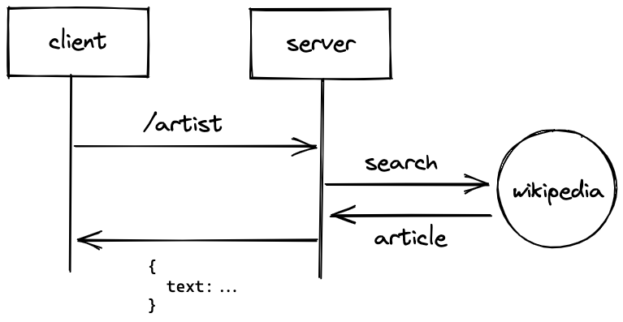

# microservice for cs361 project

This service will return the introductory paragraph from the Wikipedia article of any music artist.

## How to make a request

Send a GET request to `/artist` with URL param `name` with the name of the artist or band are searching for. Example URL: `http://localhost:3000/artist?name=Nas`

The example request ahove would return a JSON object in this format:

```
{
  "text": "Nasir bin Olu Dara Jones (born September 14, 1973), better known by his stage name Nas, is an American rapper...
}
```

## UML sequence diagram


